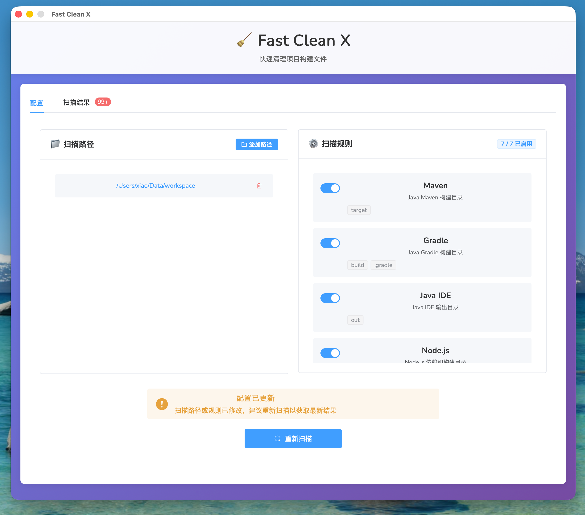
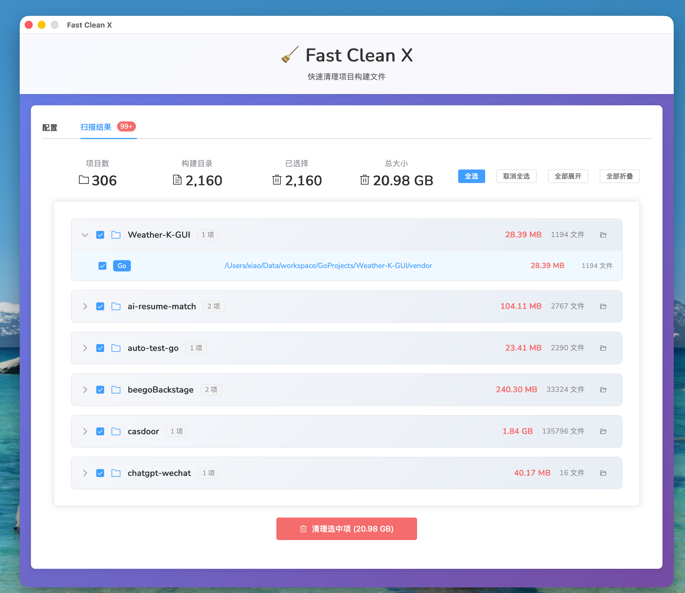

# 🧹 Fast Clean X

快速清理项目构建文件的桌面应用，帮助开发者释放磁盘空间。

[](https://github.com/hutiquan/fast-clean-x/releases)
[](LICENSE)
[](#-快速开始)
[](https://go.dev/)
[](https://vuejs.org/)
[](https://github.com/xiaoquanidea/fast-clean-x/actions)

## 📸 应用截图

### 主界面


*智能扫描和项目分组，一键清理构建文件*

### 扫描历史


*查看历史扫描记录，追踪清理效果*

## ✨ 核心功能

- 🔍 **智能扫描** - 自动识别 Java、Node.js、Python、Rust、Go 等项目的构建目录
- 📁 **项目分组** - 按项目根目录智能分组，支持多模块项目（Maven、Gradle、Monorepo）
- 🎯 **精准清理** - 项目级别或单个目录级别的选择性清理
- 📊 **可视化界面** - 直观的图形界面，展开/折叠查看项目详情
- ⚡ **高性能** - 并发扫描，快速处理大量文件
- 💾 **空间统计** - 实时显示可释放空间大小和文件数量
- 🖱️ **快捷操作** - 点击路径直接打开文件夹

## 🎯 支持的项目类型

### Java 项目
- **Maven**: `target/` 目录
- **Gradle**: `build/`, `.gradle/` 目录
- **IDE**: `out/` 目录（IntelliJ IDEA 等）

### 前端项目
- **通用**: `node_modules/`, `dist/`, `build/`
- **Vue**: `.vite/`, `.nuxt/`, `.output/`
- **React**: `.next/`, `out/`
- **其他**: `.cache/`, `.parcel-cache/`, `.turbo/`, `coverage/`

### 其他语言
- **Python**: `__pycache__/`, `.venv/`, `venv/`, `.pytest_cache/`, `.mypy_cache/`
- **Rust**: `target/`
- **Go**: `vendor/`（可选）

## 📸 功能展示

### 项目分组视图
```
📁 booking (58 项, 34.94 MB)
  ├─ Maven: booking-backend/api/target (1.32 MB)
  ├─ Maven: booking-backend/service/target (1.36 MB)
  ├─ Maven: booking-message/api/target (617 KB)
  └─ ...

📁 my-vue-app (3 项, 552 MB)
  ├─ Node.js: node_modules (500 MB)
  ├─ Node.js: dist (2 MB)
  └─ Node.js: .vite (50 MB)
```

### 智能识别项目根目录
- 自动查找 `.git`、`pom.xml`、`package.json`、`build.gradle.kts` 等项目标识
- 多模块项目自动归类到同一项目下
- 支持 Maven 父子项目、Gradle 多模块、Monorepo 等

## 🚀 快速开始

### 📥 下载使用

**[👉 前往 Releases 页面下载最新版本](https://github.com/hutiquan/fast-clean-x/releases/latest)**

#### macOS

1. 下载对应版本：
   - **Apple Silicon (M1/M2/M3/M4)**: `Fast-Clean-X-macOS-arm64.zip`
   - **Intel Mac**: `Fast-Clean-X-macOS-amd64.zip`

2. 如遇到"无法打开"或"无法验证开发者"警告：

   **方法 1: 使用修复脚本（推荐）**
   ```bash
   # 下载修复脚本
   curl -O https://raw.githubusercontent.com/your-repo/fast-clean-x/main/fix-m1-app.sh
   chmod +x fix-m1-app.sh

   # 运行修复（替换为实际路径）
   ./fix-m1-app.sh ~/Downloads/Fast-Clean-X-arm64.app
   ```

   **方法 2: 手动修复**
   ```bash
   # 移除隔离属性
   xattr -cr ~/Downloads/Fast-Clean-X-arm64.app

   # 设置执行权限
   chmod +x ~/Downloads/Fast-Clean-X-arm64.app/Contents/MacOS/fast-clean-x
   ```

   **方法 3: 右键打开**
   - 右键点击应用 → 打开 → 仍要打开

3. 开始使用！

#### Windows

1. 下载 `Fast-Clean-X-Windows-amd64.zip`

2. 解压后双击 `Fast-Clean-X-amd64.exe` 运行

3. 如遇到 Windows Defender 警告，点击"更多信息" → "仍要运行"

### 使用步骤

#### 1️⃣ 添加扫描路径
- 点击"添加路径"按钮
- 选择项目根目录（如 `~/workspace`）
- 可添加多个路径

#### 2️⃣ 配置扫描规则
- 在配置面板中启用/禁用扫描规则
- 默认启用 Maven、Gradle、Node.js、Python、Rust
- Go vendor 默认禁用（可选启用）

#### 3️⃣ 开始扫描
- 点击"开始扫描"按钮
- 等待扫描完成（大型项目可能需要几分钟）
- 自动跳转到结果页面

#### 4️⃣ 查看结果
- 结果按项目分组显示
- 点击项目头部展开/折叠查看详情
- 显示每个项目的总大小、文件数、构建目录数量
- 点击路径可直接打开文件夹

#### 5️⃣ 清理文件
- **项目级别清理**: 勾选项目复选框，一键清理整个项目的所有构建目录
- **单个目录清理**: 展开项目，勾选特定构建目录
- 点击"清理选中项"按钮执行删除
- 实时显示清理进度

### 使用技巧

💡 **快速清理整个项目**
- 勾选项目复选框 → 所有子项自动选中 → 点击清理

💡 **保留依赖，只清理构建产物**
- 展开项目 → 只勾选 `dist`、`.vite`、`target` 等
- 不勾选 `node_modules` → 点击清理

💡 **配置变更后重新扫描**
- 修改扫描路径或规则后，会自动提示重新扫描
- 点击"重新扫描"获取最新结果

## 🛠️ 开发指南

### 环境要求
- Go 1.23+
- Node.js 18+
- Wails v2.11.0

### 安装依赖
```bash
# 安装 Wails CLI
go install github.com/wailsapp/wails/v2/cmd/wails@latest

# 安装前端依赖
cd frontend && npm install
```

### 开发模式
```bash
# 启动开发服务器（支持热重载）
wails dev
```

### 构建应用

#### 一键构建（推荐）
```bash
./build.sh
```
生成：
- `build/bin/Fast-Clean-X-arm64.app` - macOS Apple Silicon 版本
- `build/bin/Fast-Clean-X-amd64.app` - macOS Intel 版本
- `build/bin/Fast-Clean-X-amd64.exe` - Windows 64位 版本

#### 手动构建
```bash
# macOS ARM64 版本（Apple Silicon）
wails build -platform darwin/arm64 -clean

# macOS AMD64 版本（Intel）
wails build -platform darwin/amd64 -clean

# Windows AMD64 版本
wails build -platform windows/amd64 -clean
```

**注意**: 在 macOS 上构建 Windows 版本需要先安装 MinGW-w64：
```bash
brew install mingw-w64
```

详细构建说明请查看 [BUILD.md](BUILD.md)

## 🏗️ 项目架构

```
fast-clean-x/
├── backend/                    # Go 后端
│   ├── models/                # 数据模型
│   │   └── models.go          # Config, ScanRule, ScanItem, ScanResult
│   ├── config/                # 配置管理
│   │   └── config.go          # 配置加载、保存、更新
│   ├── scanner/               # 扫描引擎
│   │   └── scanner.go         # 并发扫描、项目识别
│   ├── cleaner/               # 清理模块
│   │   └── cleaner.go         # 文件删除、进度报告
│   └── utils/                 # 工具函数
│       └── utils.go           # 文件操作、项目根查找
├── frontend/                   # Vue 3 前端
│   ├── src/
│   │   ├── components/
│   │   │   ├── ConfigPanel.vue    # 配置面板
│   │   │   └── ScanResults.vue    # 结果展示（分组、折叠）
│   │   ├── App.vue            # 主应用
│   │   └── main.ts            # 入口文件
│   ├── wailsjs/               # Wails 自动生成的绑定
│   └── package.json
├── app.go                      # Wails 应用绑定
├── main.go                     # 应用入口
├── wails.json                  # Wails 配置
├── build.sh                    # 构建脚本
├── README.md                   # 本文档
└── BUILD.md                    # 构建文档
```

### 核心模块说明

#### 后端 (Go)

**models/models.go**
- `Config`: 应用配置（扫描路径、规则）
- `ScanRule`: 扫描规则定义
- `ScanItem`: 扫描结果项（包含项目路径、项目名称）
- `ScanResult`: 扫描结果汇总

**scanner/scanner.go**
- 并发扫描文件系统
- 智能识别项目根目录（通过 `.git`、`pom.xml`、`package.json` 等）
- 支持取消扫描

**utils/utils.go**
- `FindProjectRoot()`: 从构建目录向上查找项目根
- `GetProjectName()`: 提取项目名称
- `hasProjectMarker()`: 检查项目标识文件

**cleaner/cleaner.go**
- 删除文件和目录
- 实时进度报告
- 错误处理

#### 前端 (Vue 3)

**ScanResults.vue**
- 项目分组逻辑（`groupedItems` computed）
- 展开/折叠功能
- 项目级别选择
- 统计信息展示

**ConfigPanel.vue**
- 扫描路径管理
- 扫描规则配置
- 配置持久化

## 🔧 技术栈

| 层级 | 技术 | 版本 |
|------|------|------|
| 后端 | Go | 1.23 |
| 前端框架 | Vue | 3.x |
| 语言 | TypeScript | 5.x |
| UI 组件 | Element Plus | 2.x |
| 构建工具 | Vite | 3.x |
| 桌面框架 | Wails | v2.11.0 |

## 📝 配置文件

配置文件自动保存在：
- **macOS**: `~/.fast-clean-x/config.json`
- **Windows**: `%USERPROFILE%\.fast-clean-x\config.json` (如 `C:\Users\YourName\.fast-clean-x\config.json`)

配置内容：
```json
{
  "scanPaths": ["/Users/xiao/workspace"],
  "ignorePatterns": [],
  "scanRules": [
    {
      "name": "Maven",
      "description": "Java Maven 构建目录",
      "targetDirs": ["target"],
      "enabled": true
    }
  ],
  "lastScanTime": "2025-11-20T14:30:00Z"
}
```

## ⚠️ 注意事项

### 安全提示
1. **删除不可恢复** - 清理操作会永久删除文件，请谨慎操作
2. **确认后再清理** - 建议先查看扫描结果，确认无误后再清理
3. **重要项目备份** - 对于重要项目，建议先备份或使用版本控制

### 可以安全删除的目录
- ✅ `node_modules` - 可通过 `npm install` 恢复
- ✅ `target`, `build` - 可通过 `mvn compile` 或 `gradle build` 重新生成
- ✅ `dist`, `.next`, `.vite` - 可通过 `npm run build` 重新生成
- ✅ `__pycache__`, `.pytest_cache` - Python 自动生成的缓存

### 不会删除的内容
- ✅ 源代码（`src/`, `main.go` 等）
- ✅ 配置文件（`package.json`, `pom.xml` 等）
- ✅ 版本控制（`.git/` 目录）
- ✅ 文档（`README.md`, `docs/` 等）

## 🐛 常见问题

### Q: 为什么有些项目没有被识别？
A: 确保项目根目录包含以下标识文件之一：
- `.git` (Git 仓库)
- `pom.xml` (Maven)
- `build.gradle` 或 `build.gradle.kts` (Gradle)
- `package.json` (Node.js)
- `Cargo.toml` (Rust)
- `go.mod` (Go)

### Q: 多模块项目为什么分散在不同项目下？
A: 检查是否每个子模块都有独立的 `.git` 目录。如果是，它们会被识别为独立项目。

### Q: 删除 node_modules 后如何恢复？
A: 在项目目录下运行 `npm install` 或 `yarn install` 即可恢复。

### Q: 应用提示"无法验证开发者"怎么办？
A: 运行 `xattr -cr /path/to/Fast-Clean-X-arm64.app` 或右键打开。

## 📄 许可证

MIT License - 详见 [LICENSE](LICENSE) 文件

## 🙏 致谢

- [Wails](https://wails.io/) - 优秀的 Go + Web 桌面应用框架
- [Element Plus](https://element-plus.org/) - 强大的 Vue 3 UI 组件库
- [Vue.js](https://vuejs.org/) - 渐进式 JavaScript 框架

---

**Made with ❤️ by hutiquan**

